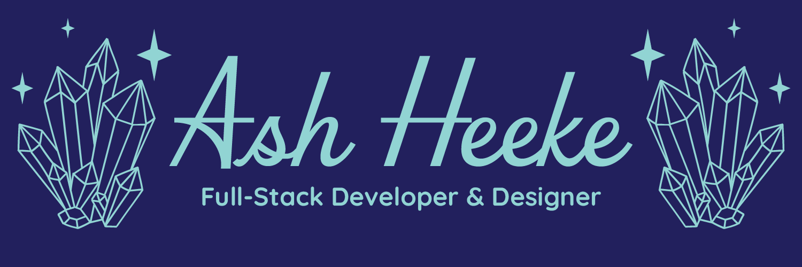

## 👋 Hi, I'm Ash!
*(she/her)*

When I was 13 years old, I taught myself HTML and CSS so I could customize my MySpace profile. I had so much fun building and designing it that when it was time to choose a major years later, it just felt like the right direction. I enrolled in Full-Stack Web Development at Arizona State University and never looked back.

I love starting with an empty file and watching a whole website come together over time. I enjoy both the building and designing sides of the process, and I’ve had the chance to explore that across web development, graphic design, print design, photography, and more throughout my time in the program.

*I build things on the internet. I've been doing it since MySpace was cool.*

🎓 Full-Stack Web Development student at ASU, graduating May 2026

## 🎨 What I Do

- 💻 Build functional, responsive websites using HTML, CSS, and JavaScript from empty file to finished product
- 🎨 Design the visuals that bring websites to life, with a strong focus on layout, typography, and user experience
- 🖨️ Create print-ready design materials for real clients, from event suites to wedding collections
- 🌟 Bring a designer's eye to every line of code, because the best websites are both well-built AND well-designed

## 🛠️ Technical Skills & Tools

**Dev Tools**

**Design Tools**

**Project Management**

## 💻 Projects

**Celestial Cat Sanctuary**
A single-page web application built with HTML, CSS, and JavaScript for a fictional cat sanctuary. Features include a button-controlled image slideshow, tabbed content sections, and a contact form with data persistence on page reload.

[View Repository](https://github.com/aheeke/celestialcatsanctuary)

**Vale's Greenhouse Website Redesign**
A multi-page website redesign for a real Canadian greenhouse business. Built with HTML, CSS, and JavaScript, featuring a live Weather API integration to display local conditions, a custom-designed logo, contact form, seasonal hours, and gift certificate page.

[View Repository](https://github.com/aheeke/valesgreenhouse)

## 🤝 Connect With Me

## ✨ Fun Fact

- 🎶 I've attended over 100 concerts and counting
- 📚 I once read all 4,544 pages of the Throne of Glass series in one week, and I have zero regrets.

